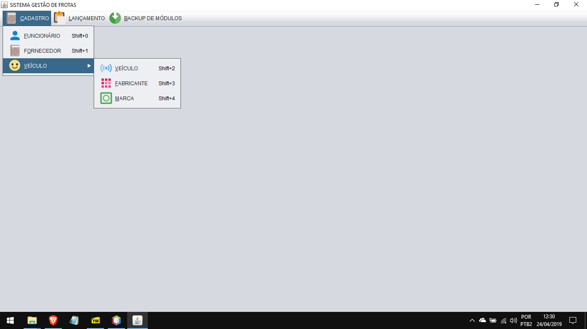

# Vehicle Fleet Management
Desktop software to manage vehicle fleets (maintenance, fuel entries, etc)
## Developed on Netbeans with Java Swing
### Functionalities:
* Cars
* Employees
* Suppliers
* Fuel entries
* Maintenances
* Accidents
* Tickets
* Deliveries
* Backup records on .csv files
### For distribution (.jar file)
[Program ready to be used](GestaoFrota.jar)
### Full project (compacted .zip file)
[Full project](GestaoFrota.zip)
### Main class 
[Main menu](Tela/Menu.java)

### Screenshots
#### Main menu

#### Cars

